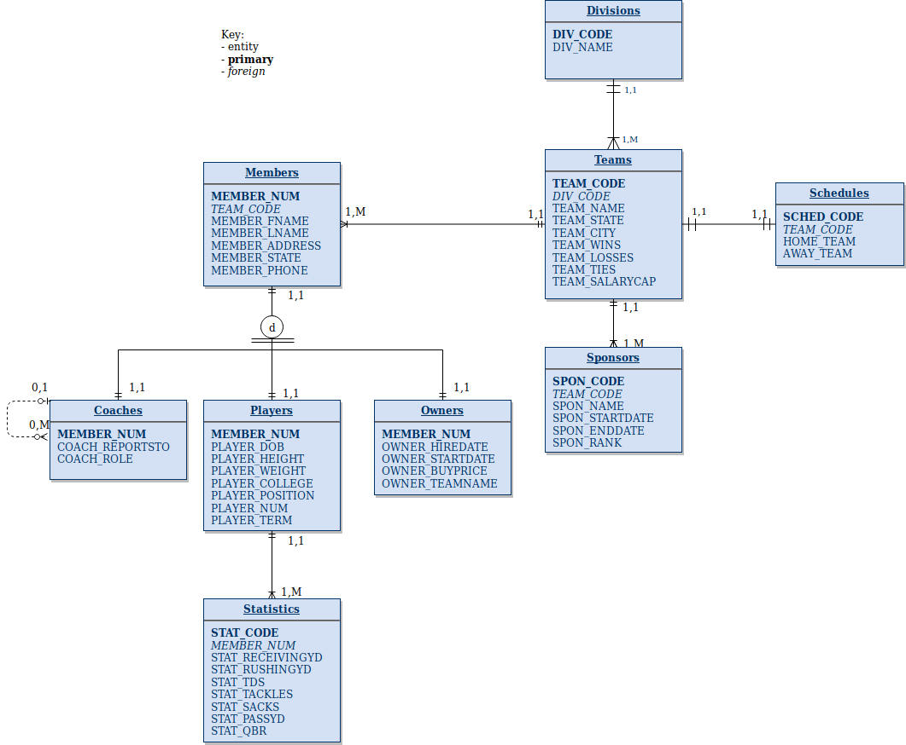

# CSC3210-GroupProject :computer:
> Contributors: Matthew Olker, Spencer Peters, Chad Sigmon, Rahul 
> 
> This is the final group project for the CSC3210 class, involving making a database with multiple tables and multiple attributes per table to show an understanding of database design. 
### Topic: Sports :football:
* Because of the need to have many different tables that make sense to be apart, we chose football specifically because it is something Spencer understands and it is something we can effectively split into many tables without it seeming meaningless. It also allows for different types of relationships that will show we understand database design and the basics of mySQL.
* Tables
	* Divisions
	* Teams
	* Seasons
	* Sponsors
	* Members
	* Coaches
	* Players
	* Owners
	* Statistics
### Business Rules
* Divisions to Teams:
	* One team belongs to one division
	* One division has many teams
* Teams to Schedule: 
	* A team is assigned a schedule
	* Each schedule is assigned to a team 
* Teams to Sponsors:
	* One team is sponsored by many sponsors 
	* One sponsor sponsors a team 
* Teams to Members:
	* One team includes many members
	* Each member is included in a team
* Member to Players:
	* A member can be a Player 
	* A Player is a Member 
* Players to Statistics:
	* A player has many statistics 
	* Many statistics are made by a player
* Members to Owners:
	* A member can be an owner 
	* Each owner is a member
* Members to Coaches:
	* A member can be a coach 
	* Each coach is a member 
* Coaches to Coaches:
	* Many coaches (assistant) can report to a coach (head)
	* A coach can not report to anyone (head coach) 

### Normalization Process
We normalized our teams and our seasons table so that it is a 1-1 relationship by changing the seasons table to a schedule table. 
<!-- if parts aren't normalized, state why -->

* Divisions
	* Division Code (PK)
	* Division Name

* Schedules
	* Schedule Code (PK)
	* Team Code
	* Home Team
	* Away Team

* Team
	* Team Code (PK)
	* Division Code (FK)
	* Team Name
	* Team State
	* Team City
	* Team Wins
	* Team Losses
	* Team Ties
	* Salary Cap

* Sponsors
	* Sponsor Code (PK)
	* Team Code (FK) 
	* Sponsor name 
	* Sponsor start date
	* Sponsor end date
	* Sponsor rank (i.e tickets given)

* Members
	* Member Num (PK)
	* Team Code (FK)
	* Member FName
	* Member LName
	* Member Address
	* Member State
	* Member Phone 
		* No need to separate out phone area code or address line (street num/name). More focused on member/player info

* Coaches
	* Member Num (PK)
	* Coach Reports to (self to self relationship)
	* Coach Role

* Players
	* Member Num (PK)
	* Player Date of Birth
	* Player Height (total inches)
	* Player Weight (total lbs rounded)
	* Player College
	* Player Position(Ex: QB , RB, LB)
	* Player Number
	* Player Contract Term

* Owners
	* Member Num (PK)
	* Owner Hire Date
	* Owner Start Date
	* Owner Acquisition Price

* Statistics
	* Member Num
	* Stat Receiving yards
	* Stat Rushing Yards
	* Stat Touchdowns
	* Stat Tackles 
	* Stat Sacks
	* Stat Passing yards 
	* Stat QBR 
	* Stat Code (PK)
	* Member Stat Num (FK)
* Schedule
	* Schedule Code(PK)
	* Team Code(FK)
	* Home Team 
	* Away Team

### Entity Relationship Diagram

